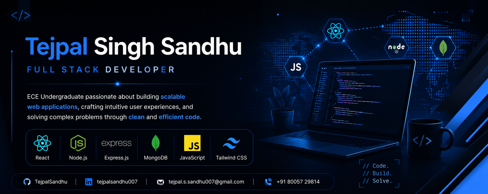
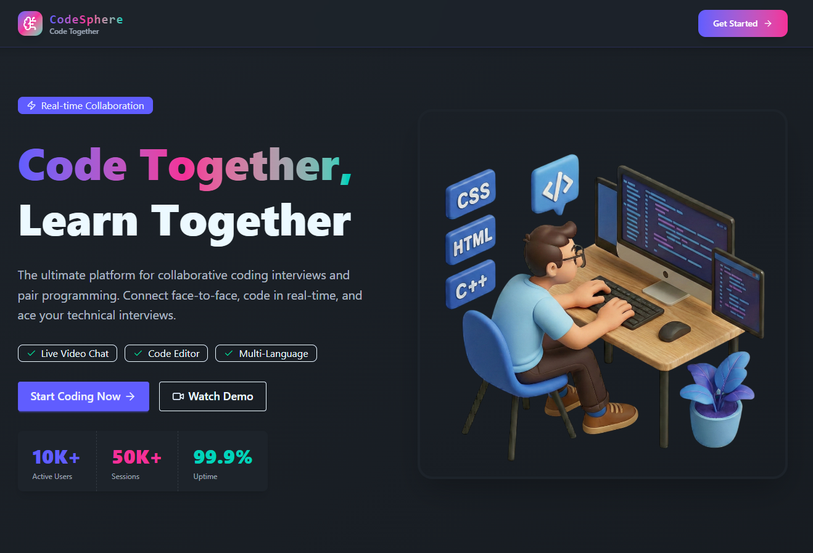
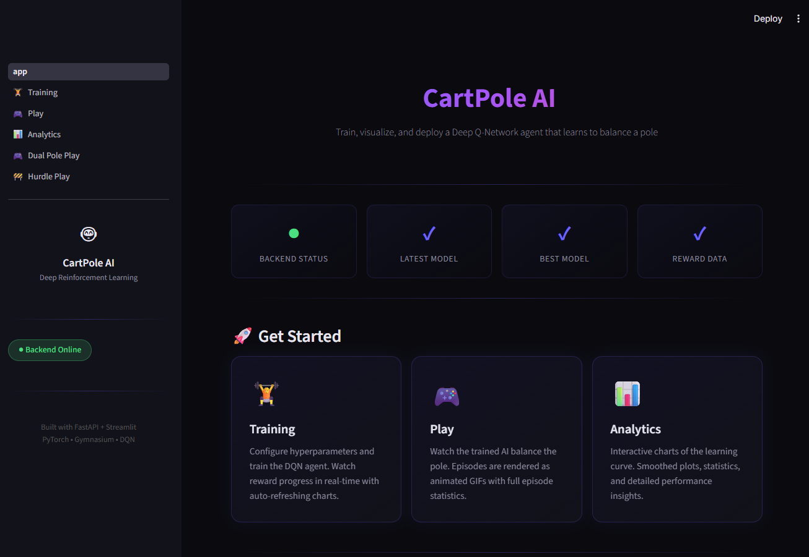
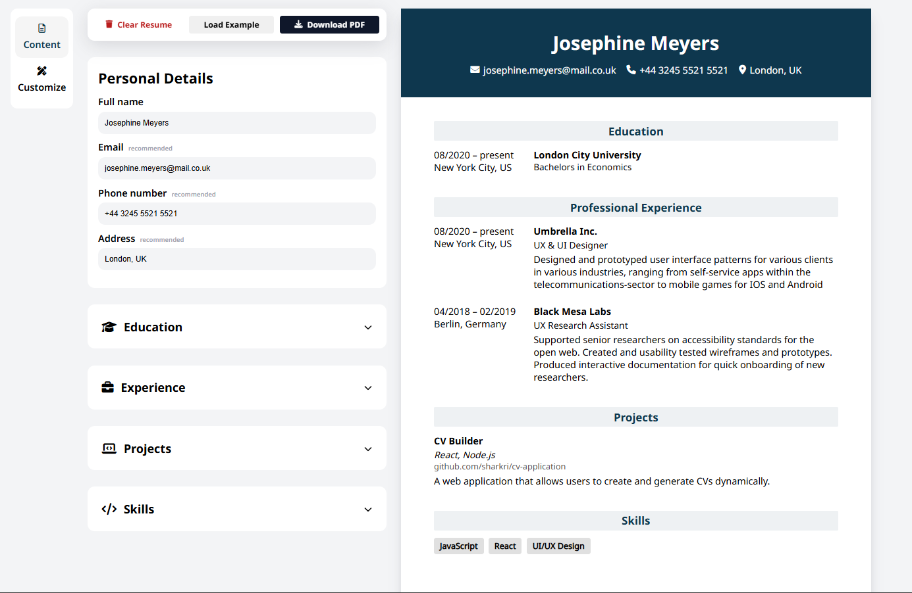
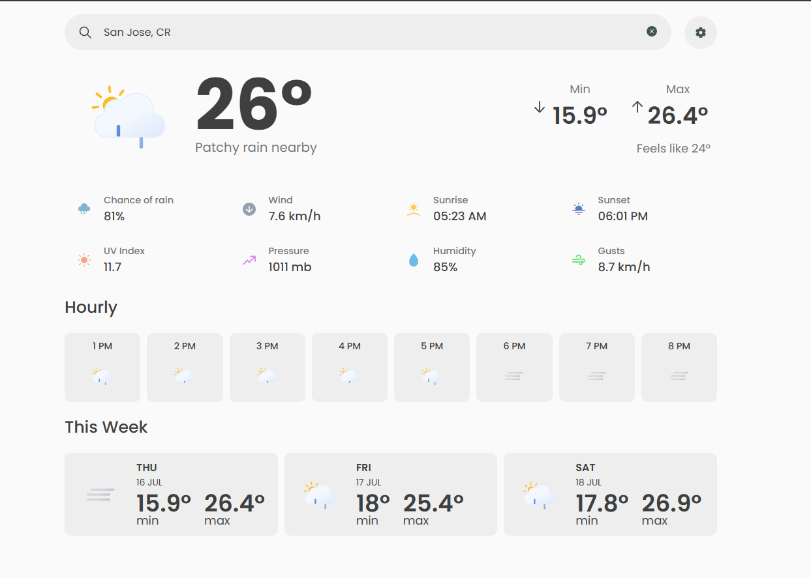

  

 

<h1 align="center">
Hi, I'm <b>Tejpal Singh Sandhu</b> 👋
</h1>

<h3 align="center">
Full Stack Developer
</h3>

Building scalable web applications with a focus on clean architecture, backend engineering, and exceptional user experiences.

ECE Undergraduate • Backend Enthusiast • Problem Solver

 

---

# 👨🏻‍💻 About

I'm an **Electronics & Communication Engineering undergraduate** at **Thapar Institute of Engineering & Technology** with a passion for building **production-quality web applications**.

I enjoy transforming ideas into real products using modern web technologies while continuously improving my understanding of **Backend Engineering**, **Software Design**, and **Data Structures & Algorithms**.

### A little about me

- 🎓 B.E. Electronics & Communication Engineering @ TIET
- 💻 Full Stack Developer with a strong interest in Backend Engineering
- 🚀 Building scalable web applications using React, Node.js, Express, MongoDB & MySQL
- 📚 Currently strengthening Data Structures & Algorithms and System Design
- 🌱 Learning by building real-world software

---
# ⚙️ Technologies

<table width="100%">
<tr>
<td valign="top" width="50%">

### 💻 Languages

C++, C, JavaScript, Python

</td>
<td valign="top" width="50%">

### 🎨 Frontend

Also experienced with: TanStack Query, DaisyUI

</td>
</tr>

<tr>
<td valign="top">

### ⚙️ Backend

REST APIs, JWT Auth, WebSockets, Inngest

</td>
<td valign="top">

### 🗄️ Database

MongoDB, Mongoose, MySQL, Sequelize

</td>
</tr>

<tr>
<td valign="top">

### 🛠️ Tools

Git, GitHub, VS Code, Postman

</td>
<td valign="top">

### 📚 Currently Exploring

Docker, AWS, TypeScript, System Design

</td>
</tr>
</table>
---

# 🧠 Core Computer Science

- Data Structures & Algorithms
- Object-Oriented Programming
- DBMS
- Operating Systems
- Computer Networks

---

# 🚀 Highlighted Projects

Projects that best represent my software engineering skills, problem-solving ability, and passion for building production-quality applications.

 

<table>

<tr>

<td width="50%" valign="top">

### 🚀 CodeSphere

Real-time collaborative coding interview platform featuring live video calls, shared code editor, integrated chat, and multi-language code execution.

**Tech Stack**

`React` • `Node.js` • `Express` • `MongoDB` • `WebRTC` • `WebSockets` • `Inngest`

<!-- Uncomment after deployment -->

<!--

-->

</td>

<td width="50%" valign="top">

### 🤖 CartPole AI

Deep Reinforcement Learning implementation where an intelligent agent learns to balance a pole using Deep Q-Learning.

**Tech Stack**

`Python` • `PyTorch` • `OpenAI Gym`

</td>

</tr>

<tr>

<td width="50%" valign="top">

### 📄 Dynamic CV Builder

Interactive resume builder with live preview, customizable templates, and instant PDF export.

**Tech Stack**

`React` • `JavaScript` • `HTML` • `CSS`

</td>

<td width="50%" valign="top">

### 🌦 Weather App

Modern weather dashboard using the OpenWeather API with responsive UI and asynchronous data fetching.

**Tech Stack**

`JavaScript` • `REST API` • `HTML` • `CSS`

</td>

</tr>

</table>

---

# 📈 GitHub Analytics

---

# 📚 Currently Exploring

<table>

<tr>

<td width="50%">

### Backend Engineering

- Advanced Express.js
- Scalable REST API Design
- Authentication & Authorization
- Event-Driven Architecture

</td>

<td width="50%">

### Cloud & DevOps

- Docker
- AWS
- CI/CD
- Deployment Strategies

</td>

</tr>

<tr>

<td>

### Computer Science

- Data Structures & Algorithms
- System Design
- Design Patterns

</td>

<td>

### Currently Building

- Production-grade Web Applications
- Backend-focused Projects
- Open Source Ready Repositories

</td>

</tr>

</table>

---

# 🤝 Let's Connect

&nbsp;&nbsp;&nbsp;

&nbsp;&nbsp;&nbsp;

<i>
Thanks for visiting my profile! Feel free to explore my repositories or connect with me.
</i>

